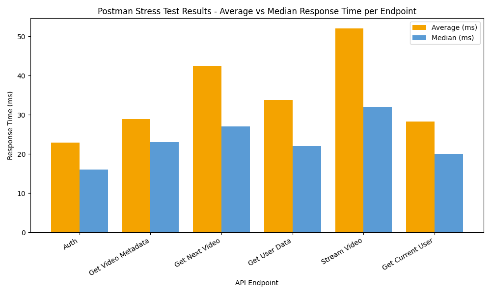

# GTEE-MAX Postman Stress Test Report

## Overview
This report summarizes the results of the Postman stress tests.  
All endpoints returned HTTP 200 responses, indicating successful requests.

---

## Test Summary

| API Endpoint | Average (ms) | Median (ms) | Max (ms) | Samples |
|---------------|--------------|--------------|-----------|----------|
| Auth | 22.93 | 16.00 | 187.00 | 100 |
| Get Video Metadata | 28.89 | 23.00 | 135.00 | 100 |
| Get Next Video | 42.39 | 27.00 | 534.00 | 100 |
| Get User Data | 33.77 | 22.00 | 322.00 | 100 |
| Stream Video | 52.00 | 32.00 | 806.00 | 100 |
| Get Current User | 28.32 | 20.00 | 211.00 | 100 |

---

## Performance Chart

---

## Key Insights

- **All endpoints responded successfully (HTTP 200)**.
- **`Average Response Time`** reflects the mean latency across 100 samples.
- **`Median Response Time`** indicates the midpoint of all request durations — half were faster, half slower.
- **`Max Response Time`** helps identify potential outliers or bottlenecks.

---

### Notes
- Test executed with a delay of 50 ms between requests.
- Total iterations: 100.
- Duration: 1m 54s

---